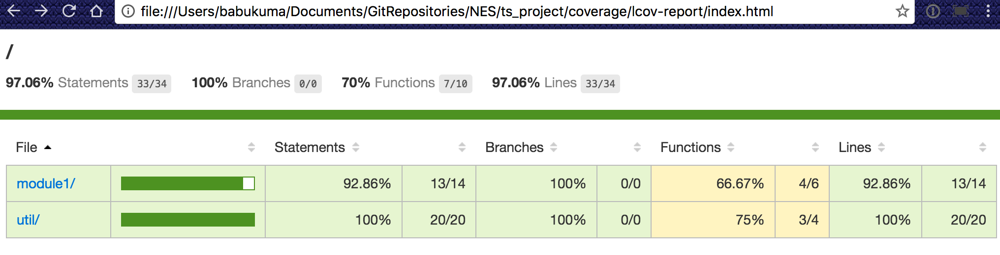

# Node.js + TypeScript project template

## 事前準備

### Node.js

1. Official Site : https://nodejs.org/
2. Version
   * 2016-11-17の時点で「`v6.9.1 LTS`」を推奨
   * 最低対象は「v4.x」以上(v5.x, v7.xは対象外)
   * バージョン別メンテナンス終了日
      * v4
         * Active LTS End(長期サポート終了日) : 2017-04-01
         * Maintenance End(最低限サポート終了日) : 2018-04-01
      * v6
         * Active LTS End(長期サポート終了日) : 2018-04-18
         * Maintenance End(最低限サポート終了日) : 2019-04-18
      * 参照 : [LTS schedule](https://github.com/nodejs/LTS#lts-schedule)
3. Install
   * Node.jsのバージョン管理をしない場合
      * Official Site : https://nodejs.org/
   * Node.jsのバージョン管理をする場合
      * Windows : [nodist](https://github.com/marcelklehr/nodist)
      * macOS, Linux : [nodebrew](https://github.com/hokaccha/nodebrew)

### Gulp

The streaming build system.

1. Official Site : http://gulpjs.com
2. Install : ```npm install --global gulp-cli```

### TypeScript 2

TypeScript is a typed superset of JavaScript that compiles to plain JavaScript.

1. Official Site : https://www.typescriptlang.org/
2. Install : 「package.json」で管理するため、Globalにインストールする必要はない

### Typings

The TypeScript Definition Manager

1. Official Site : https://github.com/typings/typings
2. Install : ```npm install -g typings```

---

## Project構成

```
ts_project
├── README.md
├── app
├── coverage
├── gulpfile.js
├── node_modules
├── package.json
├── src
│   ├── app  // アプリソース用コード
│   │   ├── app.ts
│   │   └── module1
│   │       ├── module01.ts
│   │       └── module02.ts
│   └── test // Test用ソースコード
│       └── module1
│           ├── module01_test.ts
│           └── module02_test.ts
├── test
├── tsconfig.json
├── tslint.json
├── typings
└── typings.json
```

1. app (directory)
    * コンパイルされたNode.JSアプリの本体
    * Sources : src/app/**/*.ts
    * VCS管理対象外
2. coverage (directory)
    * Coverageレポート出力先
    * VCS管理対象外
3. gulpfile.js
    * build file
4. node_modules (directory)
    * Node.jsのモジュールがインストールされるディレクトリ
    * VCS管理対象外
5. package.json
    * Node.jsのモジュール管理ファイル
6. src/app/**/*.ts
    * TypeScript Sources
    * src/app/app.ts : Entry pointになるファイル
    * src/app/{Module}/ : Module
7. src/test/**/*.ts
    * testing files
8. test (directory)
    * testing filesのコンパイル先
    * Sources : src/test/**/*.ts
    * VCS管理対象外
9. tsconfig.json
    * TypeScriptの設定ファイル
10. tslint.json
    * TSLintの設定ファイル
11. typings (directory)
    * TypeScript Definition filesがインストールされるディレクトリ
    * VCS管理対象外
12. typings.json
    * TypeScript Definition files管理 

---

## プロジェクトを作成（開発リーダー向け）

### 1. create a project directory

```
mkdir ts_project
cd ts_project
```

### 2. create a package.json file

```
npm init -y
```

### 3. install packages for development

```
npm install --save-dev gulp
npm install --save-dev typescript
npm install --save-dev gulp-typescript
npm install --save-dev tslint
npm install --save-dev gulp-tslint
npm install --save-dev mocha
npm install --save-dev gulp-mocha
npm install --save-dev istanbul
npm install --save-dev gulp-istanbul
```

### 4. create a tsconfig.json

1. tsconfig.json document : https://www.typescriptlang.org/docs/handbook/tsconfig-json.html
2. Example

```json
{
    "compilerOptions": {
        "module": "commonjs",
        "target": "es5",
        "noImplicitAny": true,
        "removeComments": true,
        "preserveConstEnums": true,
        "outDir": "dest",
        "sourceMap": true
    },
    "include": [
        "src/**/*.ts"
    ],
    "exclude": [
        "node_modules",
        "**/*.spec.ts"
    ]
}
```

### 5. create a tslint.json

1. tslint.json document : https://palantir.github.io/tslint/usage/tslint-json/
2. generate tslint.json
```bash
./node_modules/.bin/tslint --init
```

### 6. install TypeScript definition files

1. Typings document : https://github.com/typings/typings
2. Example

```sh
# node
typings install dt~node --global --save
# mocha
typings install dt~mocha --global --save
```

### 7. create a gulpfile.js

1. gulpfile.js document : https://github.com/gulpjs/gulp
2. Example

```js
"use strict";
const gulp = require("gulp");
// check style for typescript
const tslint = require("gulp-tslint");
// compile typescript
const ts = require("gulp-typescript");
const tsProject = ts.createProject('tsconfig.json');
// for testing
const mocha = require('gulp-mocha');
// for coverage
const istanbul = require('gulp-istanbul');

gulp.task('build', () => {
    var tsResult = gulp.src("src/**/*.ts")
        .pipe(tslint({
            tslint: require("tslint"),
            formatter: "verbose"
        }))
        .pipe(tslint.report())
        .pipe(tsProject());
    return tsResult.js.pipe(gulp.dest('.'));
});

gulp.task('pre-test', () => {
    return gulp.src('app/**/*.js')
        // Covering files
        .pipe(istanbul())
        // Force `require` to return covered files
        .pipe(istanbul.hookRequire());
});

gulp.task('test', ['pre-test'], () => {
    return gulp.src("test/**/*_test.js")
        // Unit test
        .pipe(mocha())
        // Creating the reports after tests ran
        .pipe(istanbul.writeReports())
        // Enforce a coverage of at least 90%
        .pipe(istanbul.enforceThresholds({ thresholds: { global: 90 } }));
});

gulp.task('default', ['build', 'test']);
```

### 8. add npm-scripts in package.json

1. npm-scripts document : https://docs.npmjs.com/misc/scripts
2. Example

```
{
  ....
  "scripts": {
    "start": "node app/app.js",
    "test": "gulp test",
    "build": "gulp build"
  },
  ....
}
```

### 9. create a ignore file

gitもしくはsubversion用のignore

```
# gitの場合

# Created by https://www.gitignore.io

### macOS ###
.... macOS 対応 ignore list ....

### Windows ###
.... Windows 対応 ignore list ....

### VisualStudioCode ###
.... VisualStudioCode 対応 ignore list ....

### Node ###
.... Node.js 対応 ignore list ....

### Project ###
app
test
coverage
!src

```

---

## 既存プロジェクトをCloneして構築（開発メンバー向け）

1. clone or copy a project directory
2. install packages and TypeScript definition files

```bash
cd ts_project
npm install
typings install
```

---

## Node.jsモジュール管理

1. 開発時必要なモジュールとアプリ起動時必要なモジュールを区別して管理する事
```bash
npm install --save-dev gulp  # 開発時のみ使用するモジュール
npm install --save socket.io # アプリ起動時必要なモジュール
```

2. Node.jsモジュールインストールされる**node_modules**ディレクトリはVCS管理対象外

3. このテンプレートは最小限のモジュールしか対応されていないため、以下のような必要なモジュールは個別のプロジェクトで開発リーダーが対応してください。
    * Node.jsモジュール検索 : https://www.npmjs.com/
    * livereload : https://github.com/vohof/gulp-livereload
    * forever : https://github.com/foreverjs/forever

---

## TypeScript Definition Files 管理

1. TypeScript Definition(Declaration) Fileについて
    * 参照 : https://www.typescriptlang.org/docs/handbook/declaration-files/introduction.html
2. Definition files管理は**TSD**ではなく**Typings**を使用する。
    * 2016年1月27日以降TSDは非推奨になっている(https://github.com/DefinitelyTyped/tsd/issues/269)
3. Typings
    * 使い方はOfficial site参照
    * Official site : https://github.com/typings/typings
    * Definition filesがインストールされる**typings**ディレクトリはVCS管理対象外

---

## TypeScript設定

1. tsconfig.json
    * TypeScriptのコンパイルオプションの設定ファイル
    * 参照 : https://www.typescriptlang.org/docs/handbook/tsconfig-json.html
2. moduleオプションについて
    * Node.js アプリのため、module仕様は**commonjs**を指定
    * Example
```json
{
    "compilerOptions": {
        "module": "commonjs",
        "target": "es5",
        "noImplicitAny": true,
        "removeComments": true,
        "preserveConstEnums": true,
        "outDir": "dest",
        "sourceMap": true
    },
    "include": [
        "src/**/*.ts"
    ],
    "exclude": [
        "node_modules",
        "**/*.spec.ts"
    ]
}
```

---

## TSLint

1. TypeScriptコードのスタイルチェックツール
    * Official size : https://palantir.github.io/tslint/
2. tslint.json
    * TSLintの設定ファイル
    * ファイル生成
```bash
./node_modules/.bin/tslint --init
```
    * Example
```json
{
    "rules": {
        "class-name": true,
        "comment-format": [
            true,
            "check-space"
        ],
        "indent": [
            true,
            "spaces"
        ],
        "no-duplicate-variable": true,
        "no-eval": true,
        "no-internal-module": true,
        "no-trailing-whitespace": true,
        "no-unsafe-finally": true,
        "no-var-keyword": true,
        "one-line": [
            true,
            "check-open-brace",
            "check-whitespace"
        ],
        "quotemark": [
            true,
            "double"
        ],
        "semicolon": [
            true,
            "always"
        ],
        "triple-equals": [
            true,
            "allow-null-check"
        ],
        "typedef-whitespace": [
            true,
            {
                "call-signature": "nospace",
                "index-signature": "nospace",
                "parameter": "nospace",
                "property-declaration": "nospace",
                "variable-declaration": "nospace"
            }
        ],
        "variable-name": [
            true,
            "ban-keywords"
        ],
        "whitespace": [
            true,
            "check-branch",
            "check-decl",
            "check-operator",
            "check-separator",
            "check-type"
        ]
    }
}
```


---

## Coding guidelines

1. Official TypeScript Coding guidelines
    * https://github.com/Microsoft/TypeScript/wiki/Coding-guidelines
2. TypeScript StyleGuide and Coding Conventions
    * https://basarat.gitbooks.io/typescript/content/docs/styleguide/styleguide.html

---

## Build

```npm run build```コマンドでビルド（package.jsonにbuild script設定前提）

Example
```bash
$ npm run build

> ts_project@1.0.0 build /Users/babukuma/Documents/GitRepositories/NES/ts_project
> gulp build

[12:54:39] Using gulpfile ~/Documents/GitRepositories/NES/ts_project/gulpfile.js
[12:54:39] Starting 'build'...
[12:54:41] Finished 'build' after 1.76 s
```

---

## Unit Test

1. Mocha : test framework
    * Mocha is a feature-rich JavaScript test framework running on Node.js and in the browser, making asynchronous testing simple and fun.
    * Official site : http://mochajs.org/
2. Testコードの書き方
    * Official site参照
    * Example
```typescript
/// <reference path="../../../typings/index.d.ts" />
import * as assert from "assert";
import { Calcurator } from "../../app/util/calcurator";

describe("Calcurator", () => {
    describe("#add()", () => {
        it("should correct result", () => {
            assert.equal(3, Calcurator.add(1, 2));
            assert.equal(6, Calcurator.add(1, 2, 3));
            assert.equal(7, Calcurator.add(1, 2, 3, 1));
        });
    });

    describe("#subtract()", () => {
        it("should correct result", () => {
            assert.equal(-1, Calcurator.subtract(1, 2));
            assert.equal(0, Calcurator.subtract(3, 2, 1));
            assert.equal(-5, Calcurator.subtract(1, 2, 3, 1));
        });
    });
});
```
3. Test実行
```
$ npm test
or
$ gulp test
```

4.  成功時の結果例
```
  Calcurator
    #add()
      ✓ should correct result
    #subtract()
      ✓ should correct result

  Module02
    #add()
      ✓ should correct result


  3 passing (7ms)
```

5. 失敗時の結果例
```
  Module02
    #add()
      ✓ should correct result

  Calcurator
    #add()
      1) should correct result
    #subtract()
      ✓ should correct result


  2 passing (9ms)
  1 failing

  1) Calcurator #add() should correct result:

      AssertionError: 8 == 7
      + expected - actual

      -8
      +7
      
      at Context.<anonymous> (test/util/calcurator_test.js:9:20)
```

---

## Unit Test Coverage

1. istanbul : a JS code coverage tool written in JS
    * Official site : https://github.com/gotwarlost/istanbul
    * gulp-istanbul : https://github.com/SBoudrias/gulp-istanbul
2.  実行
```
$ npm test
or
$ gulp test
```

3. レポート例
    * Console
```
-------------------|----------|----------|----------|----------|----------------|
File               |  % Stmts | % Branch |  % Funcs |  % Lines |Uncovered Lines |
-------------------|----------|----------|----------|----------|----------------|
 module1/          |    92.86 |      100 |    66.67 |    92.86 |                |
  module_sample.js |    92.86 |      100 |    66.67 |    92.86 |              7 |
 util/             |      100 |      100 |       75 |      100 |                |
  calcurator.js    |      100 |      100 |       75 |      100 |                |
-------------------|----------|----------|----------|----------|----------------|
All files          |    97.06 |      100 |       70 |    97.06 |                |
-------------------|----------|----------|----------|----------|----------------|


=============================== Coverage summary ===============================
Statements   : 97.06% ( 33/34 )
Branches     : 100% ( 0/0 )
Functions    : 70% ( 7/10 )
Lines        : 97.06% ( 33/34 )
================================================================================
```

    * output report file : ./coverage/lcov-report/index.html


---

## Run

```
npm start
```